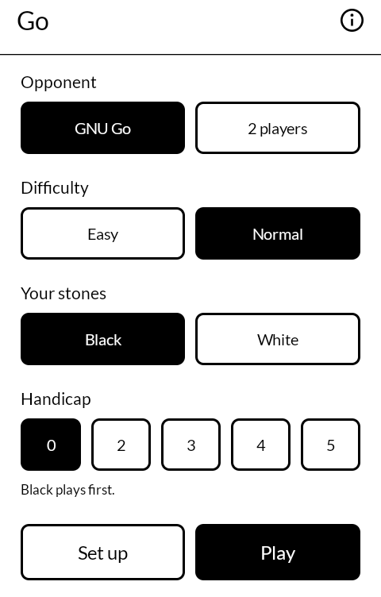
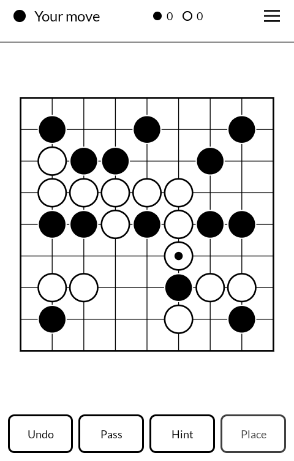
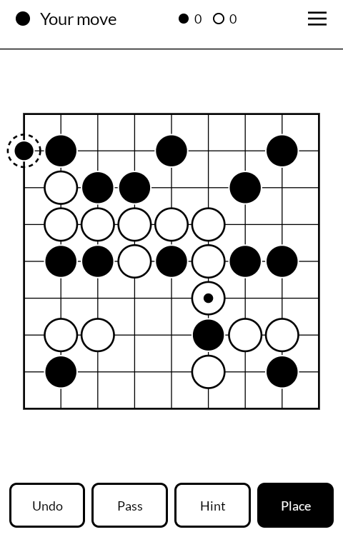
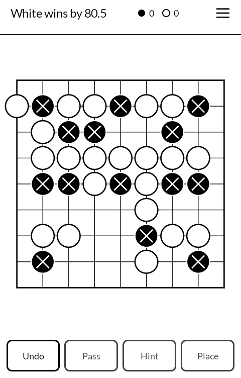

# 九路盤 kuroban — Go

A game of Go for the [Mudita Kompakt](https://mudita.com/products/kompakt/), built for its
E Ink screen. 9x9, against GNU Go or two people passing one phone back and forth.

*Kuroban* is 九路盤 — a nine-road board. The 路 are the lines you play on, so a full board is a
十九路盤 and this one is the small board: the one you learn on, the one a game finishes on in an
evening, and the only one that was ever going to fit a phone this size.

Not a fork. Written from scratch in Kotlin and Jetpack Compose, using Mudita's own
[MMD](https://github.com/mudita/MMD) design system so it looks like the apps the phone
already ships with, with GNU Go bundled as the engine.

| | |
|---|---|
|  |  |
|  |  |

## What it does

- 9x9 board, only. The engine handles any size and the board would scale, but 19x19 on
  a 360dp-wide panel gives 18dp touch targets, which is not a game anyone enjoys playing.
- Against GNU Go at two strengths, playing either colour, or two players on one device,
  pass-and-play.
- Handicap of 2 to 5 stones. A difficulty setting cannot make an engine a fair contest for a
  beginner; handicap can.
- Set up a position by hand and play it out. Put black and white stones anywhere, say which
  colour plays, and the game carries on from there with everything else unchanged - Hint,
  taking a move back, and counting at the end. It is the plainest way to work through a
  problem out of a book, which is how people studied Go for a thousand years before an app
  offered to mark their answers for them.
- Hint asks the engine what it would play and offers it as a preview stone, so you can
  accept it or ignore it. Nothing is committed by asking.
- Tap to preview, tap again to place. A stone is never played by a stray touch. The
  Place button does the same thing for anyone who would rather press a button.
- Take back a move, and against GNU Go, its reply along with it. A finished
  game can be taken back into, so a game lost to one careless move is still worth looking at.
- Two passes end the game and GNU Go scores it, including working out
  which stones are dead. Those are marked with a × on the board.
- It keeps the game you were in the middle of. Turn the phone off mid-game and it comes
  back, undo history included.
- No permissions and no network. Nothing leaves the phone, because there is no route off
  it. See [PRIVACY.md](PRIVACY.md).

## Learning the small board

Almost everything written about Go is about the 19x19 board. *81 Little Lions* by Immanuel
deVillers is an introduction to the 9x9 one, and it is free to read at
<https://archive.org/details/81LittleLions>. It is not mine and it is not bundled - it is
just the best thing to hand somebody who has this app and no idea what to do with it.

## Why only two difficulty settings

Because on a 9x9 board the engine only has two. Measured by self-play with colours
alternating: levels 1 and 3 are indistinguishable (9-7 over 16 games), and so are levels 5
and 10 (12-12 over 24 games, mean margin a tenth of a point). The only real step is between
3 and 5 - and level 10 costs ten times the thinking time of level 5, 3.4s against 0.33s per
move on the Kompakt, to play no better.

GNU Go's Monte Carlo mode, which it offers for 9x9, genuinely is stronger - it beats classic
level 10 seven games to one. But it takes 14 seconds a move on this phone, and its strength
is the sheer number of simulations, so there is no cheap version of it: cut down to 1.3s a
move it scores 26-28 against level 5, which is a coin.

So the ladder stops where the engine does, and handicap is the dial for anything finer.

## The engine

GNU Go 3.8 runs as a child process and is spoken to over
[GTP](https://www.lysator.liu.se/~gunnar/gtp/gtp2-spec-draft2/gtp2-spec.html) on its
stdin/stdout, the same way Chess+ talks UCI to Stockfish.

The engine is authoritative for *everything*: legality, ko, captures, and scoring. This
app implements no Go rules of its own - it asks. That is only affordable because GNU Go
answers a 9x9 position in single-digit milliseconds on this phone, and it means the board
you see can never disagree with the rules being enforced.

`engine/build-gnugo.sh` builds it. See [engine/README.md](engine/README.md) for why that
takes two passes and what it does to the binary's name.

## Building

Needs the Android SDK, and the NDK plus a host C compiler if you are rebuilding the engine.

```sh
./engine/build-gnugo.sh     # only needed if the bundled libgnugo.so is missing or stale
./gradlew testDebugUnitTest
./gradlew assembleRelease
```

Releases are built by `.github/workflows/release.yml` on a `v*` tag. It refuses to build
without the signing secret, rebuilds the engine from the vendored tarball rather than
trusting the committed binary, and checks the finished APK carries the expected signing
certificate before publishing it.

Release builds are signed with a keystore in `signing/`, which is gitignored. There is no
fallback: without it `assembleRelease` produces an *unsigned* APK, which will not install
anywhere. That is deliberate — a signing key committed to a public repo is not a signing key,
it is a formality, and a missing one should stop you rather than quietly hand you something
installable. (`assembleDebug` still works, signed with the usual Android debug key.)

## Getting it, and keeping it

Download <https://github.com/wanderwildwood/kuroban/releases/latest/download/kuroban.apk> and
sideload it. That address always points at the newest release, and every release publishes a
`.sha256` beside the APK if you would rather check than trust.

For updates without doing this by hand, add this repository to
[Obtainium](https://github.com/ImranR98/Obtainium):

    https://github.com/wanderwildwood/kuroban

It will offer each new release as it appears. **The application id is settled** — updates
install over what you have, keeping your settings and anything the app has stored.

## Licence

GPL-3.0-only. See [LICENSE](LICENSE).

This app bundles [GNU Go](https://www.gnu.org/software/gnugo/), Copyright 1999-2009 by the Free
Software Foundation, Inc., released under the GPL version 3 or later. Bundling it makes this
whole work GPL too; version 3 is the version taken here. GNU Go's complete corresponding
source is in `engine/gnugo-3.8.tar.gz`, unmodified, along with the script that builds it.
